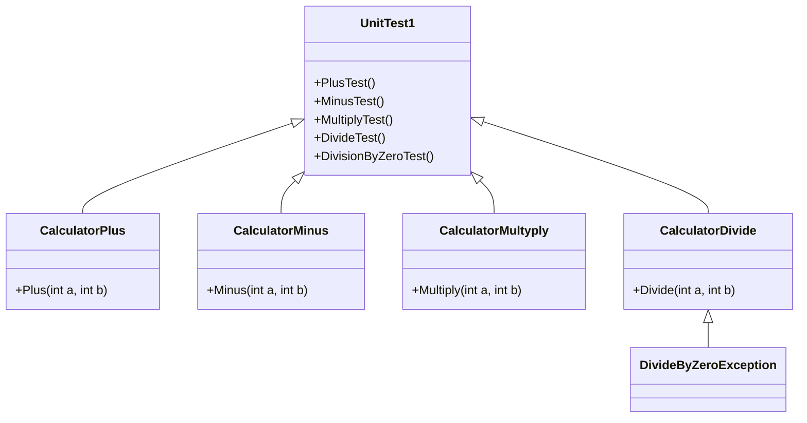

Так, на всякий, Григорьев Илья, ИСП-307

Диграмма классов:

```mermaid
classDiagram
UnitTest1 <|-- CalculatorPlus
UnitTest1 <|-- CalculatorMinus
UnitTest1 <|-- CalculatorMultyply
UnitTest1 <|-- CalculatorDivide
CalculatorDivide <|-- DivideByZeroException
    class UnitTest1 {
        +PlusTest()
        +MinusTest()
        +MultiplyTest()
        +DivideTest()
        +DivisionByZeroTest()
    }

    class CalculatorPlus {
        +Plus(int a, int b)
    }

    class CalculatorMinus {
        +Minus(int a, int b)
    }

    class CalculatorMultyply {
        +Multiply(int a, int b)
    }

    class CalculatorDivide {
        +Divide(int a, int b)
    }

    class DivideByZeroException
```
